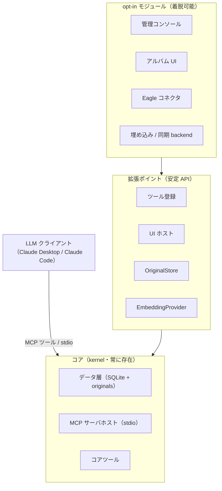
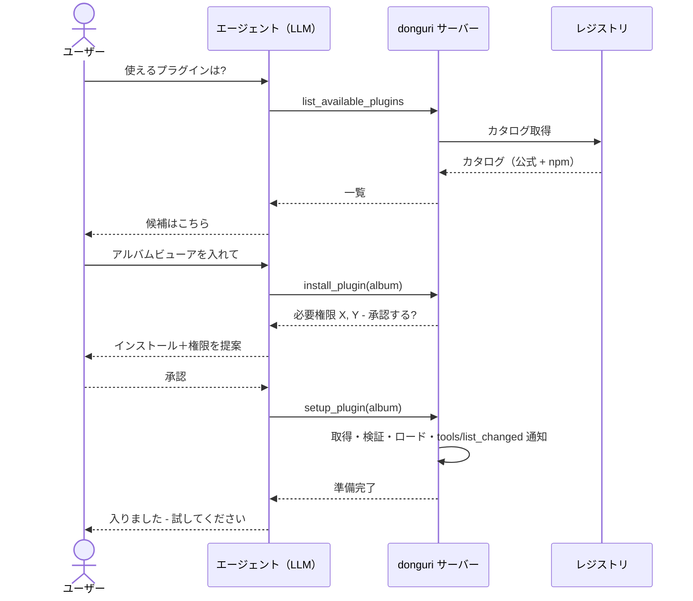

# donguri-journal — 設計

[English](DESIGN.md) | **日本語**

このドキュメントは donguri-journal の設計意図と「確定した決定」を記録します。README の
「使い方（how）」を補う「なぜ（why）」です。まだ未実装の機能には **計画（planned）** と
明記します。

> **一言でいうポジショニング:** donguri-journal は、AI コンパニオンのための
> ローカルファースト・時間軸対応の*記憶器官*です。マルチモーダル LLM が人の体験を低摩擦で
> 貯め込み、時間を越えて掘り返すためのもの。**エージェントの作業記憶ではなく**、
> **ノートアプリでもなく**、**クラウドサービスでもありません**。

マスコットは、掘り返すよりはるかに速くドングリ（donguri）を貯め込むリス——これは
donguri-journal の中心にある分担に対応します。コアは **capture（捕捉）** して何ひとつ
失わないために存在し、貯め込んだ山を掘り返すこと——**recall（想起）**・振り返り・
再浮上——は、より難しく開かれた側面で、そこを **プラグイン** が拡張します。

---

## 1. 何であり、何でないか

**である:**

- AI コンパニオンの背後にある永続的な**記憶**。**MCP** 経由で提供。
- **ローカルファースト**かつ**単一所有者**: すべてが SQLite ファイル1つ＋ローカルの
  originals ディレクトリに収まる。クラウド不要・アカウント不要。
- **時間が第一級**: すべてのエントリが `created_at`（捕捉時）と `occurred_at`（出来事の
  発生時）の両方を持つ。これが差別化点——*人間の時間を越えた振り返り*を解くのであって、
  エージェントの作業記憶ではない。
- **拡張可能なプラットフォーム**: 小さなコア＋ opt-in プラグイン。拡張しやすさ自体が
  製品価値。

**でない:**

- capture/recall の **UI**（インターフェースは LLM クライアント）。
- **知能・抽出エンジン**（vision/音声/URL の抽出はフロントのマルチモーダル LLM が担い、
  サーバーは VLM/Whisper を動かさない）。
- **エージェントの作業記憶**（行動のための知識グラフ的スクラッチパッド）。
- **アセット管理**（それは Eagle 等。donguri は原本を参照/保存できるが、価値は記憶/想起
  レイヤにある）。
- **クラウド SaaS** や **協働**ツール（単一所有者・複数端末はあり得るが、マルチユーザーは
  決してない）。

### ポジショニング・マップ

donguri は「人間の振り返り × LLM 仲介（UIなし）× ローカルファースト」の象限に位置し、
近隣のツールとは別物です。

| | エージェントの作業記憶 | 人間の振り返り |
| --- | --- | --- |
| **手動 / UI 操作** | — | ノート/日記アプリ（Obsidian, Day One） |
| **LLM 仲介** | KG メモリ系 MCP サーバー | **donguri-journal**（ローカルファースト） |

AI ノート/ライフログ（Mem, Rewind）は近いが、クラウド寄り。donguri の独自性は
*ローカルファースト・MCP ネイティブ・マルチモーダルは LLM 委譲* の3点です。

---

## 2. 確定原則（黙って覆さない）

1. **マルチモーダル LLM が必須前提。** サーバー側に vision/音声モデルは持たない。フロントの
   LLM が忠実なテキストを抽出して渡す。
2. **オリジナルとインデックス（2層）。** 原本は verbatim 保持、ベクトルインデックスは
   使い捨て・再構築可能。`original_ref` が原本を指し、`body` が（多くは LLM 抽出の）
   インデックス対象テキストを保持。`extraction_state` が `body` の生成方法を記録し、抽出を
   やり直せる。
3. **時間が第一級。** 両方のタイムスタンプを保存。値は UTC に正規化し、TEXT カラムに対する
   辞書順の範囲/ソートが正しく保たれるようにする。
4. **既定でゼロセットアップの埋め込み。** インプロセスの transformers.js
   （`Xenova/all-MiniLM-L6-v2`, 384 次元）。`EmbeddingProvider` で差し替え可能。
   `embedding_meta` がバックエンド変更を検知し再インデックスを促す。
5. **検索は2系統、意図的に分離。** `query_entries`＝構造化 SQL、`recall_related`＝ベクトル
   意味検索。LLM が選ぶ。統合しない。
6. **ツール説明文はプロダクト面。** LLM がいつ各ツールを呼ぶかを誘導する。文面も製品の一部
   として扱う。
7. **小さなコア、それ以外はすべて opt-in。** 重い/任意の機能（画像音声の便利機能・Eagle・
   クラウド埋め込み・同期・各種 UI）は opt-in プラグイン。低い既定セットアップ障壁が
   第一の価値。
8. **所有者は削除できる。** 原本は*システムによって*破壊されない（抽出/再インデックスで
   失わない）が、所有者は自分のデータを削除できる——誤って捕捉した秘密の**完全消去**を含む。
9. **言語は TypeScript。** 重い ML は LLM ＋埋め込みライブラリに委譲。本体は MCP ＋
   ローカル DB ＋（将来の）CRDT/P2P 同期。
10. **ライセンスは MIT。**

---

## 3. 実行モデル

MCP サーバーは**常駐デーモンではありません**。LLM クライアントが子プロセスとして起動し、
**stdio** で通信し、セッション終了とともに死にます。永続するのは**データ**（SQLite ＋
originals ディレクトリ）です。

帰結:

- `stdout` は MCP プロトコル専用。ログはすべて `stderr` へ。
- 「常駐/トレイ」体験には*別の*プロセスが必要（後述の UI ホストや任意の Tauri シェル）——
  「サーバーが生き続ける」のではない。
- 複数プロセス（使い捨ての MCP サーバーと UI ホスト）が同じ SQLite を触りうる。WAL モードで
  同時読み書きを安全にする。

---

## 4. アーキテクチャ: 小さなコア＋ opt-in モジュール

### 拡張ポイント

| ポイント | モジュールが足すもの | 状態 |
| --- | --- | --- |
| ツール登録 | 追加の MCP ツール | コア配線あり・モジュール API は**計画** |
| UI ホスト / route | 共有 UI ホストにマウントする Web ビュー | **計画** |
| `OriginalStore` | 原本の保存先（local / Eagle / cloud） | interface あり ✅ |
| `EmbeddingProvider` | 埋め込みバックエンド（local / Ollama / cloud） | interface あり ✅ |

### カーネル文脈（`ctx`）

モジュールはコア内部に手を伸ばさず、小さく**バージョン付きの `ctx`** だけに依存する:
データ操作（capture/query/recall/aggregate）、原本 get/save、設定アクセス、ツール登録、
stderr ロガー。`ctx` を小さく安定に保つことが拡張の安全性の本体であり、「拡張可能」という
約束の土台。

---

## 5. データモデル

**`entries`**（記憶1件＝1行）: `id`、`body`（インデックス対象テキスト）、`source_kind`
（`text`/`image`/`audio`/`url`/`note`）、`original_ref`、`extraction_state`
（`verbatim`/`llm_extracted`）、`tags`（JSON）、`meta`（JSON）、`occurred_at`、
`created_at`、`content_hash`。重複排除は `sha256(body + occurred_at)` の UNIQUE
インデックス。タイムスタンプは UTC に正規化。

**`vec_entries`** — 使い捨ての [sqlite-vec](https://github.com/asg017/sqlite-vec)
`vec0(embedding float[dim])` インデックス、`rowid = entries.id`。KNN:
`WHERE embedding MATCH ? AND k = ? ORDER BY distance`。rowid は BigInt でバインドしないと
sqlite-vec が拒否する。

**`embedding_meta`** — 単一行（`model_id`, `dim`）。バックエンド変更検知用。
**`schema_meta`** — スキーマ版。

**originals（原本）** — content-addressed なローカルストア: `<sha256>` という名前の blob ＋
MIME と元ファイル名を持つ `<sha256>.json` サイドカー。`original_ref = local:<sha256>`。
アドレスはハッシュのみなので、filename/MIME に関わらず同一バイトは重複排除される。埋め込みは
常に抽出テキストから作られ、メディア自体からは作らない。

ソフト削除は `deleted_at` tombstone カラムを使う（読み取りからは除外、同一内容の再 capture で
復活）。ハード削除は行とベクトルを物理削除し、参照カウント経由で最後の参照が消えた原本も
削除し、残骸が残らないよう VACUUM する。

---

## 6. ツール

実装済み（✅）と計画（🔜）:

| ツール | 役割 | 状態 |
| --- | --- | --- |
| `capture` | 記憶を貯める。メディアは `original_data`（base64）も送り原本を verbatim 保存 | ✅ |
| `query_entries` | 時刻 / タグ / 種別による構造化検索 | ✅ |
| `recall_related` | 意味ベクトル想起 | ✅ |
| `generate_review` | 日/週/月レビュー: PNG チャート＋集計＋提示ヒント | ✅ |
| `surface_patterns` | 再発テーマ（過去エントリのこだま）＋チャート＋ヒント | ✅ |
| `reindex` | バックエンド変更後に原本からベクトルインデックスを再構築 | ✅ |
| `get_original` | `original_ref` で原本を取得（画像はインライン返却） | ✅ |
| `storage_stats` | 容量: 件数・DB サイズ・原本バイト・種別/月別 | ✅ |
| `delete_entry` | エントリ削除。`mode` = soft（復元可）/ hard（完全消去） | ✅ |
| `open_management_ui` / `open_album` / `close_*` | opt-in UI モジュールの起動/停止 | 🔜 |
| `list_installed_plugins` | 導入済みプラグイン＋ケイパビリティ | ✅ |
| `install_plugin` / `uninstall_plugin` | ローカル導入（提案＋承認・即ロード）/ 削除 | ✅ |
| `list_available_plugins` / `setup_plugin` / `enable_plugin` / `disable_plugin` | レジストリ discovery ＋ 高度なライフサイクル | 🔜 |

エクスポートは意図的に「データを返すツール」にしない——§7 参照。

---

## 7. 削除とエクスポート

**削除は所有者主導で、ユーザーが選べる**（動機: 誤って捕捉した秘密を確実に消せること）:

- **ソフト削除**（既定）: tombstone を立てる。復元可能。将来の同期と相性が良い。
- **ハード削除**（purge）: エントリ行（`body` に秘密が入りうる）、ベクトル、そして参照
  カウント経由で原本 blob（最後の参照が消えた時）を物理削除。確実な消去のため `VACUUM`
  （必要なら上書き）まで行い、SQLite の WAL/freelist に残骸が残らないようにする。

**エクスポート/バックアップは LLM にやらせない**（トークン爆発するため）。代わりに管理 UI
から起動するサーバー側操作とし（あるいはファイルを書いてパスだけ返すツール）、バルクデータは
会話を通さない。形式の想定: エントリ＋メタの JSONL に originals を同梱（例: zip）。

---

## 8. 管理 UI（opt-in）

capture/recall のインターフェースは LLM のまま。UI は別の opt-in な
**管理/点検コンソール**——「巣の点検ハッチ」——で、会話が苦手なことのためにある:

- **About / 状態**: バージョン、DB パス、originals ディレクトリ、埋め込みモデル/次元、
  スキーマ版、ツール一覧。
- **容量**: 件数・DB サイズ・原本バイト・種別/月別の内訳。
- **管理**: エントリの閲覧/検索、原本プレビュー、**削除/エクスポート**、タグ編集。
- **保守**: reindex 実行、バックエンド変更の警告表示。

決定事項:

- **エージェント起動・ユーザーは CLI を使わない。** MCP ツール（`open_management_ui`）が UI を
  **デタッチした**プロセスとして起動し（使い捨ての stdio サーバーに道連れにされない）、
  `localhost` の URL を返す。`close_*`＋アイドル自動終了＋二重起動防止つき。MCP ツールなので
  素の MCP クライアントでも動く。
- **コアはローカル Web UI**。後で任意の薄い **Tauri トレイ・シェル**で同じ Web UI を包んで、
  常駐/ツールバー体験を実装の二重化なしに足せる（「web-core 先、resident-tray 後」）。
- **アクセス**: `localhost` のみにバインド、トークンなし（ローカルファースト・単一ユーザー）。
  マルチユーザー機が懸念になれば、後から opt-in でトークンを追加可能。
- **共有 UI ホスト**: 1つのローカルホストプロセスが複数の UI モジュールを route
  （`/manage`, `/album` …）でマウントし、ポート乱立を防ぎライフサイクルを一元化。

**アルバムビューア**（画像を写真アルバムのように見返す）は opt-in UI モジュールの一例で、
同じ仕組み（`open_album`）で起動する。

---

## 9. 拡張 / プラグイン基盤（計画）

donguri は、**エージェントが依頼に応じて能力をインストールする**プラットフォームになるよう
設計されている——ユーザーは CLI を一切触らない。

**想定 UX:** エージェントに使えるプラグインを聞く → 一覧 → 入れたいものを依頼 →
インストールとセットアップを行う → すぐに使える。

**構成要素:**

- **レジストリ / discovery**: 公式のキュレーション済みレジストリ（署名/integrity 付きの
  ホスト済みマニフェスト）を主とする。npm のオープンなキーワード検索も可だが、未審査の結果は
  警告する。
- **プラグイン・マニフェスト**: 提供物（tools / UI / `OriginalStore` /
  `EmbeddingProvider`）、必要 config、**宣言ケイパビリティ**、対象とするカーネル API 版、
  install source ＋ integrity を宣言。
- **動的ロード**: 有効なプラグインは起動時にロード。セッション途中のインストールは MCP の
  `tools/list_changed` 通知を使い、**クライアントを再起動せずに**新しいツール/ビューを出す
  （SDK 対応は実装時に要確認）。

**信頼とセキュリティ（核心——LLM 経由で第三者コードを入れることは、私的ジャーナルに対する
任意コード実行である）:**

- **インストールは明示的なユーザー承認が必要**——エージェントが*宣言ケイパビリティ付きで*
  インストールを提案する。完全に無確認の自動インストールは不採用。
- 公式レジストリの**キュレーション＋署名/integrity**、**バージョン pin**。
- **最小権限の `ctx`**: プラグインは宣言しユーザーが承認したケイパビリティしか持てない。
- **隔離**: Node での完全なインプロセス・サンドボックスは難しいので、プロセス/ワーカー隔離は
  後段のハードニング。初日からの保証ではない。

**ビルド順:** (1) プラグイン契約 ＋ `ctx` ＋ ローカル install/enable ＋ 動的ロード、
(2) ホスト済みキュレーション・レジストリ ＋ discovery、(3) ケイパビリティ/隔離の強化。

---

## 10. ロードマップ

- **Phase 1** — SQLite ＋ sqlite-vec によるコア capture / query / recall。✅
- **Phase 1.5** — レビュー/インサイトツール（`generate_review`, `surface_patterns`）。
  PNG チャート＋構造化データ＋提示ヒント。✅
- **reindex** — バックエンド変更時に原本からベクトル再構築。✅
- **原本保存** — ローカル content-addressed ストア＋ `get_original`。✅
- **管理レイヤ** — `storage_stats` ✅ と `delete_entry`（soft/hard）✅ は完了。
  エクスポート・管理 UI・アルバム UI は計画。🔜
- **プラグイン基盤** — 契約＋kernel ctx ✅、ローカル導入＋動的ロード
  （`tools/list_changed`）✅。ホスト済みレジストリとケイパビリティ/隔離のハードニングが次
  （§9）。🔜
- **Phase 2 — ローカルファースト同期**（独立・難）: CRDT（Automerge/Yjs）＋差し替え可能
  トランスポート（libp2p による P2P / リレー / クラウドストレージ）、E2E 暗号化を最初から
  組み込む。**ブロックチェーンは不採用**（信頼モデルが違う: 単一所有者・複数端末。append-only
  は削除可能な私的ジャーナルに敵対的）。ソフト削除は CRDT モデルと相互運用するよう設計する。🔜

---

## 11. ライセンス

[MIT](../LICENSE) © Nemutame.
