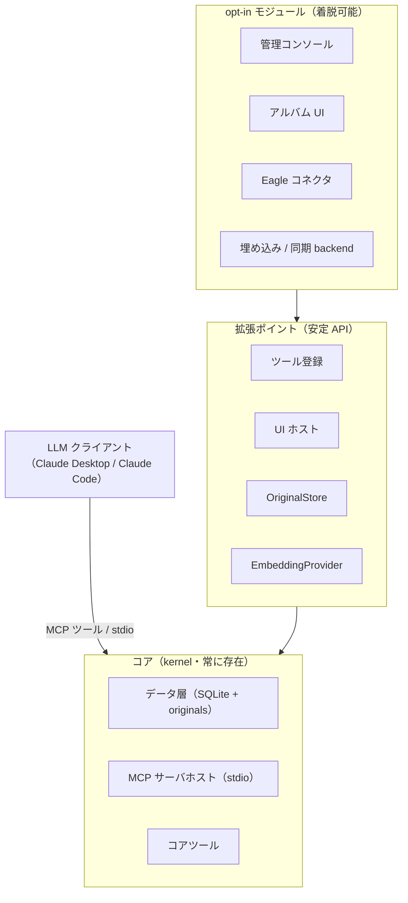
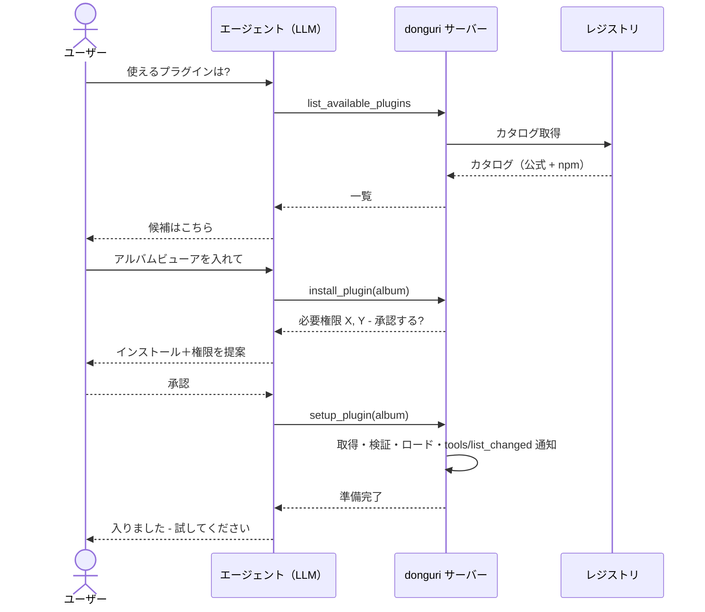

# donguri-journal — 設計

[English](DESIGN.md) | **日本語**

このドキュメントは donguri-journal の設計意図と「確定した決定」を記録します。README の
「使い方（how）」を補う「なぜ（why）」です。まだ未実装の機能には **計画（planned）** と
明記します。

> **一言でいうポジショニング:** donguri-journal は、AI コンパニオンのための
> ローカルファースト・時間軸対応の*記憶器官*です。マルチモーダル LLM が人の体験を低摩擦で
> 貯め込み、時間を越えて掘り返すためのもの。**エージェントの作業記憶ではなく**、
> **ノートアプリでもなく**、**クラウドサービスでもありません**。

マスコットは、掘り返すよりはるかに速くドングリ（donguri）を貯め込むリス——これは
donguri-journal の中心にある分担に対応します。コアは **capture（捕捉）** して何ひとつ
失わず、時間を越えて **recall（想起）** するために存在します。貯め込んだ山を*さらに*
掘り返すこと——より豊かな振り返り・再浮上・新しい切り口——は、より難しく開かれた側面で、
そこを**プラグイン**が拡張します。

---

## 1. 何であり、何でないか

**である:**

- AI コンパニオンの背後にある永続的な**記憶**。**MCP** 経由で提供します。
- **ローカルファースト**かつ**単一所有者**: すべてが SQLite ファイル1つ＋ローカルの
  originals ディレクトリに収まります。クラウドもアカウントも必要ありません。
- **時間が第一級**: すべてのエントリが `created_at`（捕捉時）と `occurred_at`（出来事の
  発生時）の両方を持ちます。これが差別化点——*人間の時間を越えた振り返り*を解くのであって、
  エージェントの作業記憶ではありません。
- **拡張可能なプラットフォーム**: 小さなコア＋ opt-in プラグイン。拡張しやすさ自体が
  製品価値です。

**でない:**

- capture/recall の **UI**（インターフェースは LLM クライアントです）。
- **知能・抽出エンジン**（vision/音声/URL の抽出はフロントのマルチモーダル LLM が担い、
  サーバーは VLM/Whisper を動かしません）。
- **エージェントの作業記憶**（行動のための知識グラフ的スクラッチパッド）。
- **アセット管理**（それは Eagle 等の領分です。donguri は原本を参照/保存できますが、
  価値は記憶/想起レイヤにあります）。
- **クラウド SaaS** や **協働**ツール（単一所有者・複数端末はあり得ますが、マルチユーザーに
  なることは決してありません）。

### ポジショニング・マップ

donguri は「人間の振り返り × LLM 仲介（UIなし）× ローカルファースト」の象限に位置し、
近隣のツールとは別物です。

| | エージェントの作業記憶 | 人間の振り返り |
| --- | --- | --- |
| **手動 / UI 操作** | — | ノート/日記アプリ（Obsidian, Day One） |
| **LLM 仲介** | KG メモリ系 MCP サーバー | **donguri-journal**（ローカルファースト） |

AI ノート/ライフログ（Mem, Rewind）は近いですが、クラウド寄りです。donguri の独自性は
*ローカルファースト・MCP ネイティブ・マルチモーダルは LLM 委譲* の3点です。

---

## 2. 確定原則（黙って覆さない）

1. **マルチモーダル LLM が必須前提。** サーバー側に vision/音声モデルは持ちません。
   フロントの LLM が忠実なテキストを抽出して渡します。
2. **オリジナルとインデックス（2層）。** 原本は verbatim 保持、ベクトルインデックスは
   使い捨て・再構築可能です。`original_ref` が原本を指し、`body` が（多くは LLM 抽出の）
   インデックス対象テキストを保持します。`extraction_state` が `body` の生成方法を記録し、
   抽出をやり直せるようにします。
3. **時間が第一級。** 両方のタイムスタンプを保存します。値は UTC に正規化し、TEXT カラムに
   対する辞書順の範囲/ソートが正しく保たれるようにします。
4. **既定でゼロセットアップの埋め込み。** インプロセスの transformers.js
   （`Xenova/all-MiniLM-L6-v2`, 384 次元）。`EmbeddingProvider` で差し替え可能です。
   `embedding_meta` がバックエンド変更を検知し再インデックスを促します。
5. **検索は2系統、意図的に分離。** `query_entries`＝構造化 SQL、`recall_related`＝ベクトル
   意味検索。LLM が選びます。統合はしません。
6. **ツール説明文はプロダクト面。** LLM がいつ各ツールを呼ぶかを誘導します。文面も製品の
   一部として扱います。
7. **小さなコア、それ以外はすべて opt-in。** 重い/任意の機能（画像音声の便利機能・Eagle・
   クラウド埋め込み・同期・各種 UI）は opt-in プラグインにします。低い既定セットアップ障壁が
   第一の価値です。
8. **コアはビュー中立。出力形式は「レンズ」。** 保存データに表示形式を焼き込みません
   （データのどこにも「BuJo」の印は現れません）。capture が記録するのは普遍的な意味論——
   性質 / 状態 / 時間粒度 / エントリ間の相関——であり、Bullet Journal のような形式はその上の
   opt-in な**読み取り専用の射影**（§6）です。レンズを外しても何も失われません。
9. **所有者は削除できる。** 原本は*システムによって*破壊されることはありません（抽出/
   再インデックスで失わない）が、所有者は自分のデータを削除できます——誤って捕捉した秘密の
   **完全消去**を含みます。
10. **言語は TypeScript。** 重い ML は LLM ＋埋め込みライブラリに委譲します。本体は MCP ＋
    ローカル DB ＋（将来の）CRDT/P2P 同期です。
11. **ライセンスは MIT。**

---

## 3. 実行モデル

MCP サーバーは**常駐デーモンではありません**。LLM クライアントが子プロセスとして起動し、
**stdio** で通信し、セッション終了とともに死にます。永続するのは**データ**（SQLite ＋
originals ディレクトリ）です。

帰結:

- `stdout` は MCP プロトコル専用です。ログはすべて `stderr` へ出力します。
- 「常駐/トレイ」体験には*別の*プロセスが必要です（後述の UI ホストや任意の Tauri シェル）
  ——「サーバーが生き続ける」のではありません。
- 複数プロセス（使い捨ての MCP サーバーと UI ホスト）が同じ SQLite を触りえます。WAL
  モードで同時読み書きを安全にしています。

---

## 4. アーキテクチャ: 小さなコア＋ opt-in モジュール

### 拡張ポイント

| ポイント | モジュールが足すもの | 状態 |
| --- | --- | --- |
| ツール登録 | 追加の MCP ツール | コア配線あり・モジュール API は**計画** |
| UI ホスト / route | 共有 UI ホストにマウントする Web ビュー | **計画** |
| `OriginalStore` | 原本の保存先（local / Eagle / cloud） | interface あり ✅ |
| `EmbeddingProvider` | 埋め込みバックエンド（local / Ollama / cloud） | interface あり ✅ |
| モジュール・ストレージ | モジュール自身の `ext_<id>_*` テーブル（§10 参照） | `ctx.storage` ✅ |

### カーネル文脈（`ctx`）

モジュールはコア内部に手を伸ばさず、小さく**バージョン付きの `ctx`** だけに依存します:
データ操作（capture/query/recall/aggregate）、原本 get/save、設定アクセス、ツール登録、
stderr ロガー、名前空間付きモジュール・ストレージ（`ctx.storage`）、purge フック
（`ctx.onEntryPurged`）。`ctx` を小さく安定に保つことが拡張の安全性の本体であり、
「拡張可能」という約束の土台です。

---

## 5. データモデル

**`entries`**（記憶1件＝1行）: `id`、`body`（インデックス対象テキスト）、`source_kind`
（`text`/`image`/`audio`/`url`/`note`）、`original_ref`、`extraction_state`
（`verbatim`/`llm_extracted`）、`tags`（JSON）、`meta`（JSON）、`occurred_at`、
`created_at`、`content_hash`。重複排除は `sha256(body + occurred_at)` の UNIQUE
インデックスで行います。タイムスタンプは UTC に正規化します。

**`vec_entries`** — 使い捨ての [sqlite-vec](https://github.com/asg017/sqlite-vec)
`vec0(embedding float[dim])` インデックス、`rowid = entries.id`。KNN:
`WHERE embedding MATCH ? AND k = ? ORDER BY distance`。rowid は BigInt でバインドしないと
sqlite-vec が拒否します。

**`entry_links`** — エントリ間の型付き相関（`from_id`, `rel`, `to_id`, `created_at`）。
向きは常に新→旧・追記のみです。ハード削除時は両方向のリンクも purge されます。§6 参照。

**`embedding_meta`** — 単一行（`model_id`, `dim`）。バックエンド変更検知用です。
**`schema_meta`** — スキーマ版。

**originals（原本）** — content-addressed なローカルストア: `<sha256>` という名前の blob ＋
MIME と元ファイル名を持つ `<sha256>.json` サイドカー。`original_ref = local:<sha256>`。
アドレスはハッシュのみなので、filename/MIME に関わらず同一バイトは重複排除されます。
埋め込みは常に抽出テキストから作られ、メディア自体からは作りません。

ソフト削除は `deleted_at` tombstone カラムを使います（読み取りからは除外、同一内容の
再 capture で復活）。ハード削除は行とベクトルを物理削除し、参照カウント経由で最後の参照が
消えた原本も削除し、残骸が残らないよう VACUUM します。

---

## 6. レンズ: ビュー中立なコア

ジャーナルのデータは、どんな単一の「見方」よりも長生きします。だから donguri は表示形式を
保存データに焼き込みません。コアは**普遍的な意味論**を記録し、出力形式——Bullet Journal、
GTD リスト、カンバン、カレンダー——はモジュールが提供する **opt-in の読み取り専用射影
（「レンズ」）**です。これがジャーナリングをコアとする本プロジェクトの基本姿勢です:
レンズを外しても何も失われず、同じエントリは query/recall からも、他のどのレンズからも
そのまま使えます。

**コアの注釈語彙（ビュー中立）。** `meta` の予約キー（すべて任意）。存在する場合はツール
境界で検証されます（それ以外の `meta` キーは従来通り自由です）:

| キー | 値 | 意味 |
| --- | --- | --- |
| `nature` | `action` / `event` / `note` | 内容が*何であるか*（`source_kind` は媒体） |
| `status` | `open` / `done` / `dropped` | アクションのライフサイクル（`done` / `dropped` が終端） |
| `priority` | `true` | 重要マーク |
| `due` | ISO 日付 | 期限 |
| `delegated_to` | 文字列 | 誰に委譲したか |
| `granularity` | `day`（既定）/ `month` | `occurred_at` がエントリを時間に置く精度 |

**相関は第一級。** `entry_links` テーブル
（`from_id, rel, to_id, created_at`）がエントリ間の型付きリンクを記録します。向きは常に
**新 → 旧**なので、関係づけが過去を書き換えることはありません。初期の `rel` 語彙は
`continues`（このエントリは過去のエントリの持ち越し/書き直し）と `references`（一般の関連）
です。

**書き換えの規律。** `body`・`occurred_at`・`content_hash`・ベクトルは不変です。`meta` は
可変な*注釈*です（状態変更は他に何も触れません——reindex 不要）。相関は追記のみです。

### 実例: BuJo レンズ

最初のレンズは、Bullet Journal のデイリー/マンスリー/フューチャーログを
読み取り専用ツール（`bujo_day`, `bujo_month`, `bujo_future`, `bujo_reconcile`）で
描画します。組み込みの**機能トグル**（`enable_feature` / `disable_feature`——
ファーストパーティのコードなのでインストールの儀式は不要です）による opt-in で、有効化すると
ツールがライブで登録され、無効化するとライブで消えます。どちらでもジャーナルのデータは
無傷です。データに BuJo の印は一切なく、すべての記号は導出されます:

| 汎用データ | BuJo 表示 |
| --- | --- |
| `action` + `open` | `•` タスク |
| `action` + `done` | `x` 完了 |
| `action` に incoming の `continues` リンク | `>` 移動 または `<` スケジュール——後継の居場所（別の日 / 当月リスト / 未来の月）から導出 |
| `action` + `dropped` | ~~取消線~~ |
| `action` + `delegated_to` | `•` … `→ @人名` |
| `event` | `○` イベント |
| `note`（または `nature` なし） | `–` メモ |
| `priority: true` | 先頭に `*` |

タスクの持ち越しは BuJo の意図的な朝の儀式であり、これは**純粋な追記**に対応します:
`bujo_reconcile` が昨日の未裁定の open アクションを提示し、ユーザーは会話で一件ずつ裁きます
——完了、破棄、または**新しいエントリ**として今日へ持ち越し（必要なら新規作成の時点で文面を
差し替えます。その摩擦こそが本質です）、`continues → 旧` でリンクします。旧エントリの更新は
不要で、incoming リンクの存在が `>` として描画させます。日や月をまたぐ `continues`
チェーンが*そのまま*マイグレーション履歴です——「3回持ち越した。これは本当にやる価値が
ある？」がクエリ可能な事実になります。

---

## 7. ツール

実装済み（✅）と計画（🔜）:

| ツール | 役割 | 状態 |
| --- | --- | --- |
| `capture` | 記憶を貯める。メディアは `original_data`（base64）も送り原本を verbatim 保存 | ✅ |
| `query_entries` | 時刻 / タグ / 種別による構造化検索 | ✅ |
| `recall_related` | 意味ベクトル想起 | ✅ |
| `generate_review` | 日/週/月レビュー: PNG チャート＋集計＋提示ヒント | ✅ |
| `surface_patterns` | 再発テーマ（過去エントリのこだま）＋チャート＋ヒント | ✅ |
| `reindex` | バックエンド変更後に原本からベクトルインデックスを再構築 | ✅ |
| `get_original` | `original_ref` で原本を取得（画像はインライン返却） | ✅ |
| `storage_stats` | 容量: 件数・DB サイズ・原本バイト・種別/月別 | ✅ |
| `delete_entry` | エントリ削除。`mode` = soft（復元可）/ hard（完全消去） | ✅ |
| `open_management_ui` / `open_album` / `close_*` | opt-in UI モジュールの起動/停止 | 🔜 |
| `list_installed_plugins` | 導入済みプラグイン＋ケイパビリティ | ✅ |
| `install_plugin` / `uninstall_plugin` | ローカル導入（提案＋承認・即ロード）/ 削除 | ✅ |
| `list_available_plugins` / `setup_plugin` / `enable_plugin` / `disable_plugin` | レジストリ discovery ＋ 高度なライフサイクル | 🔜 |
| `update_entry_status` / `link_entries` | ビュー中立の書き込み: 注釈更新＋型付きエントリ・リンク（§6） | ✅ |
| `bujo_day` / `bujo_month` / `bujo_future` / `bujo_reconcile` | BuJo レンズ: デイリー/マンスリー/フューチャーログ＋棚卸（読み取り専用射影、§6） | ✅ |
| `list_features` / `enable_feature` / `disable_feature` | 組み込みの opt-in 機能（レンズ等）: 一覧＋ライブなトグル、永続化 | ✅ |

エクスポートは意図的に「データを返すツール」にはしません——§8 をご覧ください。

---

## 8. 削除とエクスポート

**削除は所有者主導で、ユーザーが選べます**（動機: 誤って捕捉した秘密を確実に消せること）:

- **ソフト削除**（既定）: tombstone を立てます。復元可能で、将来の同期とも相性が良い
  方式です。
- **ハード削除**（purge）: エントリ行（`body` に秘密が入りえます）、ベクトル、そして参照
  カウント経由で原本 blob（最後の参照が消えた時）を物理削除します。確実な消去のため
  `VACUUM`（必要なら上書き）まで行い、SQLite の WAL/freelist に残骸が残らないようにします。

**エクスポート/バックアップは LLM には任せません**（トークン量が爆発するため）。代わりに
管理 UI から起動するサーバー側操作とし（あるいはファイルを書いてパスだけ返すツール）、
バルクデータは会話を通しません。形式の想定は、エントリ＋メタの JSONL に originals を
同梱したもの（例: zip）です。

---

## 9. 管理 UI（opt-in）

capture/recall のインターフェースは LLM のままです。UI は別の opt-in な
**管理/点検コンソール**——「巣の点検ハッチ」——で、会話が苦手なことのためにあります:

- **About / 状態**: バージョン、DB パス、originals ディレクトリ、埋め込みモデル/次元、
  スキーマ版、ツール一覧。
- **容量**: 件数・DB サイズ・原本バイト・種別/月別の内訳。
- **管理**: エントリの閲覧/検索、原本プレビュー、**削除/エクスポート**、タグ編集。
- **保守**: reindex 実行、バックエンド変更の警告表示。

決定事項:

- **エージェント起動・ユーザーは CLI を使わない。** MCP ツール（`open_management_ui`）が
  UI を**デタッチした**プロセスとして起動し（使い捨ての stdio サーバーに道連れにされない
  ように）、`localhost` の URL を返します。`close_*`＋アイドル自動終了＋二重起動防止つき
  です。MCP ツールなので素の MCP クライアントでも動作します。
- **コアはローカル Web UI**。後で任意の薄い **Tauri トレイ・シェル**で同じ Web UI を
  包めば、常駐/ツールバー体験を実装の二重化なしに足せます（「web-core 先、resident-tray
  後」）。
- **アクセス**: `localhost` のみにバインドし、トークンなし（ローカルファースト・単一
  ユーザー）。マルチユーザー機が懸念になれば、後から opt-in でトークンを追加できます。
- **共有 UI ホスト**: 1つのローカルホストプロセスが複数の UI モジュールを route
  （`/manage`, `/album` …）でマウントし、ポート乱立を防ぎライフサイクルを一元化します。

**アルバムビューア**（画像を写真アルバムのように見返す）は opt-in UI モジュールの一例で、
同じ仕組み（`open_album`）で起動します。

---

## 10. 拡張 / プラグイン基盤（計画）

donguri は、**エージェントが依頼に応じて能力をインストールする**プラットフォームになるよう
設計されています——ユーザーが CLI を触る必要はありません。

**想定 UX:** エージェントに使えるプラグインを聞く → 一覧 → 入れたいものを依頼 →
インストールとセットアップを行う → すぐに使える。

**構成要素:**

- **レジストリ / discovery**: 公式のキュレーション済みレジストリ（署名/integrity 付きの
  ホスト済みマニフェスト）を主とします。npm のオープンなキーワード検索も可能ですが、
  未審査の結果には警告を付けます。
- **プラグイン・マニフェスト**: 提供物（tools / UI / `OriginalStore` /
  `EmbeddingProvider`）、必要 config、**宣言ケイパビリティ**、対象とするカーネル API 版、
  install source ＋ integrity を宣言します。
- **動的ロード**: 有効なプラグインは起動時にロードします。セッション途中のインストールは
  MCP の `tools/list_changed` 通知を使い、**クライアントを再起動せずに**新しいツール/
  ビューを出します（SDK 対応は実装時に確認します）。

### モジュール・ストレージ（`ext_` テーブル）

opt-in モジュールは `ctx.storage(moduleId)` 経由で、共有 SQLite ファイルに**自前の
テーブル**を作れます——レンズのカスタム・コレクション（所属・並び順）、ビュー設定、
コネクタの同期状態など。規則は次のとおりです:

- **名前空間**: テーブルは `ext_<module>_*`（識別子を検証）。スキーマ版もモジュールごとに
  `schema_meta` の名前空間付きキーで管理し、コアのスキーマ版には決して触れません。
- **事実はコアに、構造はモジュールに。** ジャーナルの*事実*（想起に値するもの: タスク・
  出来事・メモ、その状態と相関）はコアの `entries` / `meta` / `entry_links` に置きます——
  すべてのレンズ・エクスポート・将来の同期から見える場所に。モジュール・テーブルが持つのは
  **ビュー固有の構造**と**再構築可能なキャッシュ**であり、エントリは **id 参照のみ**です。
- **エントリ内容のコピー禁止**——「秘密を確実に消せる」というハード削除の約束は拡張を
  越えて守られなければなりません。`ctx.onEntryPurged(hook)` で参照の掃除を登録します:
  フックは purge の*トランザクション内*で走り、モジュール行とエントリは原子的に消えます
  （フックが失敗すれば purge ごと中止します——参照を残したまま消えるよりも安全です）。
- **コアテーブルの ALTER・直接書き込み禁止。** ジャーナルへの書き込みは必ず store の公開
  API 経由で行います（dedup・埋め込み・リンク・tombstone を保つため）。プラグイン・
  セキュリティの他の部分と同じく、今日は契約＋レビュー、隔離は後段です。
- **ライフサイクル**: アンインストール時、モジュール・テーブルは既定で残します（データは
  所有者のもの。求めに応じて purge します）。DB ファイルごとのバックアップには自動で
  含まれます。JSONL エクスポートと Phase 2 の CRDT 同期はコアテーブルのみが対象です——
  事実をコアに置くもう一つの理由です。
- マニフェストは `storage` ケイパビリティを宣言し、インストール時の同意画面に出します。

**信頼とセキュリティ（核心——LLM 経由で第三者コードを入れることは、私的ジャーナルに対する
任意コード実行である）:**

- **インストールは明示的なユーザー承認が必要**——エージェントが*宣言ケイパビリティ付きで*
  インストールを提案します。完全に無確認の自動インストールは採用しません。
- 公式レジストリの**キュレーション＋署名/integrity**、**バージョン pin**。
- **最小権限の `ctx`**: プラグインは宣言しユーザーが承認したケイパビリティしか持てません。
- **隔離**: Node での完全なインプロセス・サンドボックスは難しいので、プロセス/ワーカー
  隔離は後段のハードニングとします。初日からの保証ではありません。

**ビルド順:** (1) プラグイン契約 ＋ `ctx` ＋ ローカル install/enable ＋ 動的ロード、
(2) ホスト済みキュレーション・レジストリ ＋ discovery、(3) ケイパビリティ/隔離の強化。

---

## 11. ロードマップ

- **Phase 1** — SQLite ＋ sqlite-vec によるコア capture / query / recall。✅
- **Phase 1.5** — レビュー/インサイトツール（`generate_review`, `surface_patterns`）。
  PNG チャート＋構造化データ＋提示ヒント。✅
- **reindex** — バックエンド変更時に原本からベクトル再構築。✅
- **原本保存** — ローカル content-addressed ストア＋ `get_original`。✅
- **管理レイヤ** — `storage_stats` ✅ と `delete_entry`（soft/hard）✅ は完了。
  エクスポート・管理 UI・アルバム UI は計画。🔜
- **プラグイン基盤** — 契約＋kernel ctx ✅、ローカル導入＋動的ロード
  （`tools/list_changed`）✅。ホスト済みレジストリとケイパビリティ/隔離のハードニングが次
  （§10）。🔜
- **レンズ層** — ビュー中立の注釈語彙＋ `entry_links` をコアに ✅。その上に最初の読み取り
  専用射影として BuJo レンズ（デイリー/マンスリー/フューチャーログ＋マイグレーションの
  儀式）を機能トグルによる opt-in で提供（§6）。✅
- **Phase 2 — ローカルファースト同期**（独立・難）: CRDT（Automerge/Yjs）＋差し替え可能
  トランスポート（libp2p による P2P / リレー / クラウドストレージ）、E2E 暗号化を最初から
  組み込みます。**ブロックチェーンは採用しません**（信頼モデルが違います: 単一所有者・
  複数端末。append-only は削除可能な私的ジャーナルに敵対的です）。ソフト削除は CRDT
  モデルと相互運用するよう設計します。🔜

---

## 12. ライセンス

[MIT](../LICENSE) © Nemutame.
