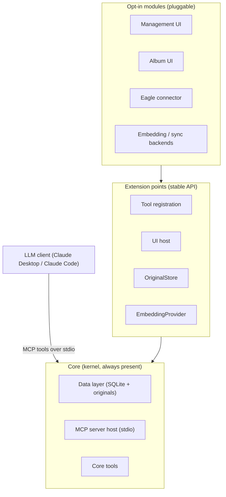
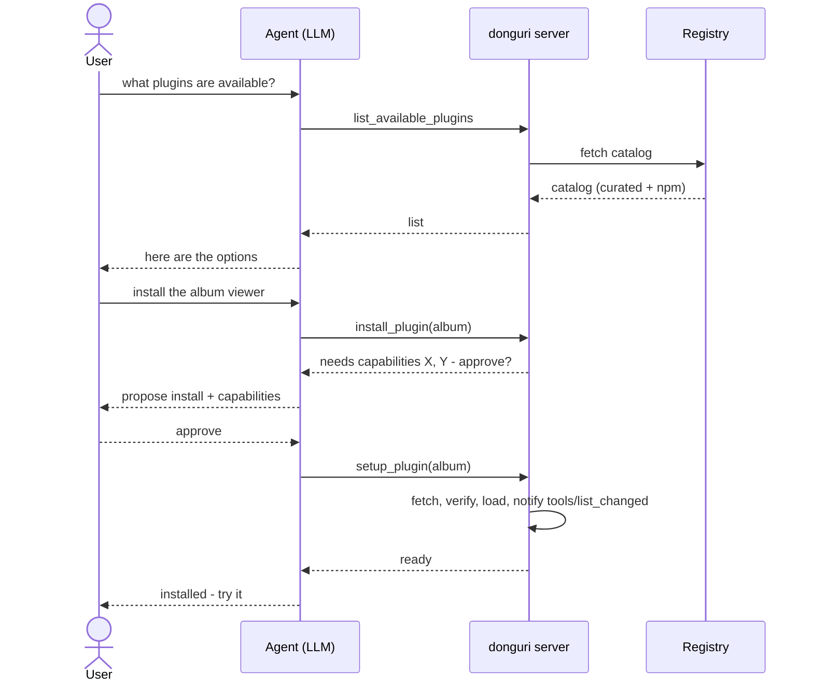

# donguri-journal — Design

**English** | [日本語](DESIGN.ja.md)

This document captures the design intent and the binding decisions behind
donguri-journal. It is the "why", complementing the README's "how to use". Where
a feature is not yet built, it is marked **planned**.

> **Positioning, in one sentence:** donguri-journal is a local-first, time-aware
> *memory organ* for an AI companion — it lets a multimodal LLM stash a person's
> moments with low friction and dig them up across time for reflection. It is
> **not** an agent's working memory, **not** a note-taking app, and **not** a
> cloud service.

The mascot is a squirrel that hoards acorns (*donguri*) far faster than it ever digs
them back up — which maps onto the split at the heart of donguri-journal. The core
exists to **capture** everything and never lose it, and to **recall** it across time;
digging the pile back up *further* — richer review, resurfacing, new lenses on the
hoard — is the harder, open-ended side that **plugins** extend.

---

## 1. What it is (and is not)

**It is:**

- A persistent **memory** behind an AI companion, exposed over **MCP**.
- **Local-first** and **single-owner**: everything lives in a SQLite file plus a
  local originals directory. No cloud, no account.
- **Time-aware**: every entry has both `created_at` (when captured) and
  `occurred_at` (when the event actually happened). This is the differentiator —
  it solves *human reflection over time*, not agent working memory.
- An **extensible platform**: a small core with opt-in plugins. Ease of
  extension is itself a product value.

**It is not:**

- A capture/recall **UI** — the LLM client is the interface.
- An **intelligence / extraction engine** — the front-end multimodal LLM does
  vision/audio/URL extraction; the server runs no VLM/Whisper.
- An **agent's working memory** (knowledge-graph scratchpad for acting).
- An **asset manager** (that's Eagle et al.; donguri can reference/store
  originals but its value is the memory/recall layer).
- A **cloud SaaS** or a **collaboration** tool (single owner, possibly multiple
  devices — never multi-user).

### Positioning map

donguri sits in the "human reflection × LLM-mediated (no UI) × local-first"
quadrant, distinct from its neighbours.

| | Agent working memory | Human reflection |
| --- | --- | --- |
| **Manual / UI-driven** | — | note / journaling apps (Obsidian, Day One) |
| **LLM-mediated** | KG memory MCP servers | **donguri-journal** (local-first) |

AI note / lifelog tools (Mem, Rewind) are close neighbours but cloud-leaning;
donguri's distinctives are *local-first, MCP-native, multimodal-via-LLM*.

---

## 2. Binding principles (do not silently reverse)

1. **Multimodal LLM is a hard requirement.** No server-side vision/audio models;
   the front-end LLM extracts faithful text and passes it in.
2. **Originals vs. index (two layers).** Originals are kept verbatim; the vector
   index is disposable and rebuildable. `original_ref` points at the original;
   `body` holds the indexed (often LLM-extracted) text. `extraction_state`
   records how `body` was produced so extraction can be redone.
3. **Time is first-class.** Both timestamps are stored; values are normalized to
   UTC so lexicographic range/sort over the TEXT columns stays correct.
4. **Zero-setup embeddings by default.** In-process transformers.js
   (`Xenova/all-MiniLM-L6-v2`, 384-dim). Swappable via `EmbeddingProvider`;
   `embedding_meta` detects a backend change and prompts a reindex.
5. **Two retrieval paths, intentionally separate.** `query_entries` = structured
   SQL; `recall_related` = vector semantic search. The LLM chooses; never merged.
6. **Tool descriptions are product surface.** They steer when the LLM calls each
   tool; treat the wording as part of the product.
7. **Small core, opt-in everything else.** Heavy/optional features (image/audio
   convenience, Eagle, cloud embeddings, sync, UIs) are opt-in plugins. Low
   default setup barrier is a primary value.
8. **Owner-deletable.** Originals are never destroyed *by the system* (extraction
   / reindex never lose them), but the owner can delete their own data — including
   a true, permanent erase for secrets captured by mistake.
9. **Language: TypeScript.** The heavy ML is offloaded to the LLM + embedding
   lib; the substance is MCP + local DB + (future) CRDT/P2P sync.
10. **License: MIT.**

---

## 3. Runtime model

The MCP server is **not a resident daemon**. The LLM client spawns it as a child
process and talks over **stdio**; it dies when the session ends. The persistent
thing is the **data** (SQLite + originals directory).

Consequences:

- `stdout` is reserved for the MCP protocol; all logging goes to `stderr`.
- A "resident / tray" experience requires a *separate* process (see the UI host
  and the optional Tauri shell below) — it is not "the server" staying alive.
- Multiple processes (an ephemeral MCP server and a UI host) may touch the same
  SQLite file; WAL mode makes concurrent read/write safe.

---

## 4. Architecture: small core + opt-in modules

### Extension points

| Point | What a module contributes | Status |
| --- | --- | --- |
| Tool registration | Additional MCP tools | core wiring exists; module API **planned** |
| UI host / route | A web view mounted on the shared UI host | **planned** |
| `OriginalStore` | Where originals are stored (local / Eagle / cloud) | interface exists ✅ |
| `EmbeddingProvider` | Embedding backend (local / Ollama / cloud) | interface exists ✅ |

### Kernel context (`ctx`)

Modules never reach into core internals; they depend only on a small, **versioned
`ctx`**: data operations (capture/query/recall/aggregate), originals get/save,
config access, tool registration, and a stderr logger. Keeping `ctx` small and
stable is what makes extension safe and is the basis of the "extensible" promise.

---

## 5. Data model

**`entries`** (one row per memory): `id`, `body` (indexed text), `source_kind`
(`text`/`image`/`audio`/`url`/`note`), `original_ref`, `extraction_state`
(`verbatim`/`llm_extracted`), `tags` (JSON), `meta` (JSON), `occurred_at`,
`created_at`, `content_hash`. Dedup is a UNIQUE index on
`sha256(body + occurred_at)`; timestamps are normalized to UTC.

**`vec_entries`** — a disposable [sqlite-vec](https://github.com/asg017/sqlite-vec)
`vec0(embedding float[dim])` index, `rowid = entries.id`. KNN:
`WHERE embedding MATCH ? AND k = ? ORDER BY distance`. The rowid must be bound as
a BigInt or sqlite-vec rejects it.

**`embedding_meta`** — single row (`model_id`, `dim`) to detect a backend change.
**`schema_meta`** — schema version.

**Originals** — content-addressed local store: a blob named `<sha256>` plus a
`<sha256>.json` sidecar holding MIME and original filename. `original_ref =
local:<sha256>`. Addressing is by hash only, so identical bytes dedup regardless
of filename/MIME. Embeddings are always made from the extracted text, never the
media itself.

Soft delete uses a `deleted_at` tombstone column (reads exclude it; re-capturing
identical content restores it). Hard delete purges the row and vector and — via
reference counting — the original when its last referencing entry is gone, then
VACUUMs so bytes do not linger.

---

## 6. Tools

Current (✅) and planned (🔜):

| Tool | Purpose | Status |
| --- | --- | --- |
| `capture` | Stash a memory; for media, also send `original_data` (base64) to store the verbatim original | ✅ |
| `query_entries` | Structured lookup by time / tag / source kind | ✅ |
| `recall_related` | Semantic vector recall | ✅ |
| `generate_review` | Day/week/month review: PNG chart + aggregates + presentation hints | ✅ |
| `surface_patterns` | Recurring themes (echoes of earlier entries) + chart + hints | ✅ |
| `reindex` | Rebuild the vector index from originals after a backend change | ✅ |
| `get_original` | Fetch a stored original by `original_ref` (images returned inline) | ✅ |
| `storage_stats` | Capacity: counts, DB size, originals bytes, by source kind / month | ✅ |
| `delete_entry` | Delete an entry; `mode` = soft (recoverable) or hard (permanent) | ✅ |
| `open_management_ui` / `open_album` / `close_*` | Launch/stop an opt-in UI module | 🔜 |
| `list_installed_plugins` | Installed plugins + capabilities | ✅ |
| `install_plugin` / `uninstall_plugin` | Local install (propose+confirm, loads live) / uninstall | ✅ |
| `list_available_plugins` / `setup_plugin` / `enable_plugin` / `disable_plugin` | Registry discovery + richer lifecycle | 🔜 |

Export is intentionally **not** a data-returning tool — see §7.

---

## 7. Deletion & export

**Deletion is owner-driven and user-selectable** (motivation: a secret captured
by mistake must be erasable):

- **Soft delete** (default): mark a tombstone; recoverable; friendly to future
  sync.
- **Hard delete** (purge): physically remove the entry row (its `body` may
  contain the secret), the vector, and — via reference counting — the original
  blob when its last reference is gone. For true erasure, also `VACUUM` (and
  consider overwrite) so remnants do not linger in the SQLite WAL/freelist.

**Export / backup is never done by the LLM** (it would explode the token
budget). Instead it is a server-side operation triggered from the management UI
(or a tool that writes a file and returns only a path); the bulk data never flows
through the conversation. Likely format: JSONL of entries + metadata, with the
originals bundled (e.g. a zip).

---

## 8. Management UI (opt-in)

The capture/recall interface stays the LLM. The UI is a separate, opt-in
**management/inspection console** — "the nest's inspection hatch" — for what
conversation is bad at:

- **About / status**: version, DB path, originals dir, embedding model/dim,
  schema version, tool list.
- **Capacity**: counts, DB size, originals bytes, breakdown by source kind /
  month.
- **Manage**: browse/search entries, preview originals, **delete / export**, edit
  tags.
- **Maintenance**: run reindex, surface a backend-change warning.

Decisions:

- **Agent-launched, no user CLI.** An MCP tool (`open_management_ui`) starts the
  UI as a **detached** process (so it outlives the ephemeral stdio server) and
  returns a `localhost` URL; with `close_*` and idle auto-shutdown and
  single-instance guarding. Because it is an MCP tool, it works in plain MCP
  clients too.
- **Local web UI is the core**; an optional thin **Tauri tray shell** can wrap
  the same web UI later for a resident/toolbar experience — without forking the
  implementation ("web-core first, resident-tray later").
- **Access**: bind to `localhost` only; no token (local-first, single user). A
  token can be added later as opt-in if a multi-user machine becomes a concern.
- **Shared UI host**: one local host process mounts multiple UI modules at routes
  (`/manage`, `/album`, …) to avoid port sprawl and centralize lifecycle.

The **album viewer** (browse images like a photo album) is an example opt-in UI
module, launched the same way (`open_album`).

---

## 9. Extension / plugin platform (planned)

donguri is designed to become a platform where the **agent installs capabilities
on request** — the user never touches a CLI.

**Intended UX:** ask the agent what plugins exist → it lists them → ask it to
install one → it installs and sets it up → it is immediately usable.

**Pieces:**

- **Registry / discovery**: a curated official registry (hosted manifest with
  signing / integrity) is primary; open npm keyword search is also allowed, with
  unaudited results flagged.
- **Plugin manifest**: declares what it provides (tools / UI / `OriginalStore` /
  `EmbeddingProvider`), required config, **declared capabilities**, the kernel
  API version it targets, and an install source + integrity.
- **Dynamic load**: enabled plugins load at startup; mid-session installs use
  MCP's `tools/list_changed` notification so new tools/views appear **without
  restarting the client** (SDK support to be verified at build time).

**Trust & security (the crux — installing third-party code via an LLM is
arbitrary code execution against a private journal):**

- **Install requires explicit user approval** — the agent proposes the install
  *with its declared capabilities*; fully silent auto-install is rejected.
- **Curation + signing/integrity** for the official registry; **version
  pinning**.
- **Least-privilege `ctx`**: a plugin only gets the capabilities it declared and
  the user approved.
- **Isolation**: full in-process sandboxing is hard in Node, so process/worker
  isolation is a later hardening step, not a day-one guarantee.

**Build order:** (1) plugin contract + `ctx` + local install/enable + dynamic
load; (2) hosted curated registry + discovery; (3) capability/isolation
hardening.

---

## 10. Roadmap

- **Phase 1** — core capture / query / recall over SQLite + sqlite-vec. ✅
- **Phase 1.5** — review / insight tools (`generate_review`, `surface_patterns`)
  with PNG charts + structured data + presentation hints. ✅
- **reindex** — rebuild vectors from originals on backend change. ✅
- **Originals** — local content-addressed storage + `get_original`. ✅
- **Management layer** — `storage_stats` ✅ and `delete_entry` (soft/hard) ✅ are
  done; export, management UI, and album UI are planned. 🔜
- **Plugin platform** — contract + kernel ctx ✅, local install + dynamic load
  (`tools/list_changed`) ✅; hosted registry and capability/isolation hardening
  are next (see §9). 🔜
- **Phase 2 — local-first sync** (separate, hard): CRDT (Automerge/Yjs) +
  pluggable transport (P2P via libp2p / relay / cloud storage), with end-to-end
  encryption built in from the start. **No blockchain** (wrong trust model:
  single owner, multiple devices; append-only is hostile to deletable private
  journals). Soft delete is designed to interoperate with the CRDT model. 🔜

---

## 11. License

[MIT](../LICENSE) © Nemutame.
